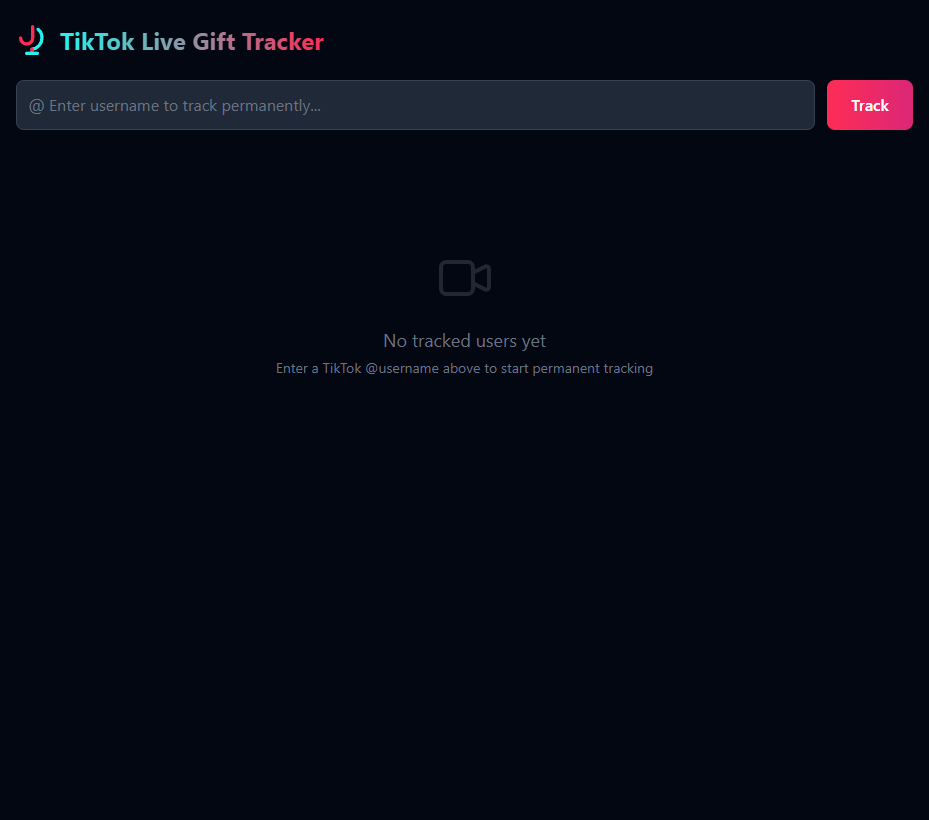
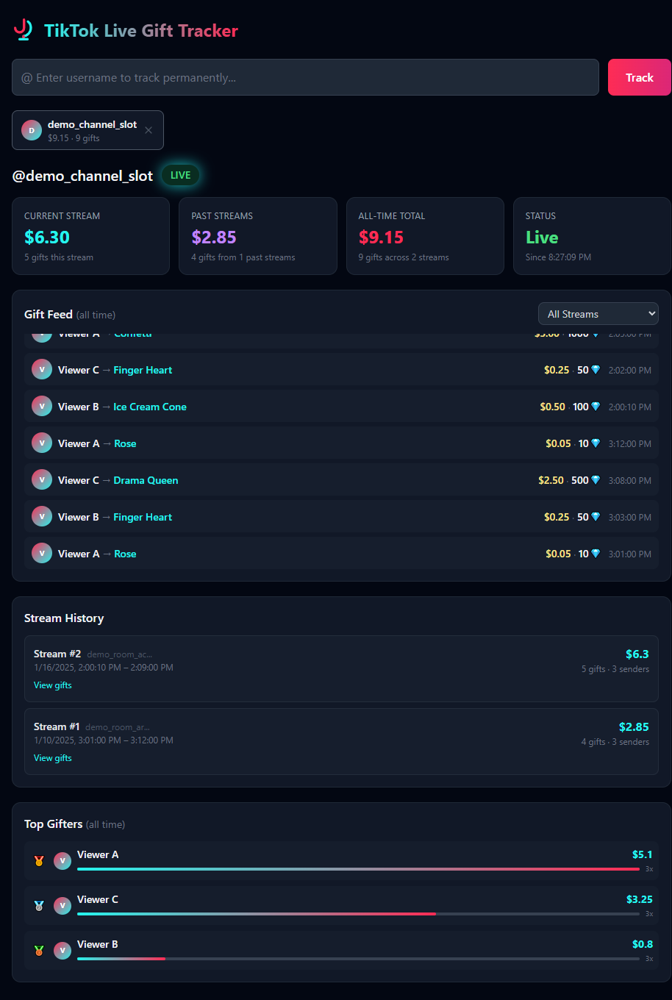

# TikTok Live Gift Tracker

Real-time gift tracking and chat logging dashboard for TikTok live streams. Connects to public TikTok WebSockets (no API keys required) and tracks every gift and chat message sent during a livestream with persistent historical data.

[](https://chartmann1590.github.io/tiktok-live-gift-tracker/)
[](https://github.com/chartmann1590/tiktok-live-gift-tracker)


## Screenshots

The images below use **synthetic labels and demo data only** (no real TikTok users or profile links). To regenerate them locally, see the header comment in [`scripts/seed_screenshot_db.py`](scripts/seed_screenshot_db.py) and run the app with `DISABLE_TIKTOK_LISTENERS=1` so no live WebSocket connections are opened.





## Support & sponsor

This project is **MIT-licensed and free to self-host** — no paywalls, no API keys, no tracking. If it helps your stream, your agency, or your workflow, **consider sponsoring** so I can keep improving reliability, docs, and features.

[](https://buymeacoffee.com/charleshartmann)

**Why donate?** Your support pays for time on bug fixes, compatibility when TikTok changes behavior, better dashboards, and keeping the docs site (above) up to date. A coffee’s worth goes a long way — thank you.

- **Buy Me a Coffee:** [buymeacoffee.com/charleshartmann](https://buymeacoffee.com/charleshartmann)
- **Project site (docs & overview):** [chartmann1590.github.io/tiktok-live-gift-tracker](https://chartmann1590.github.io/tiktok-live-gift-tracker/)

## Features

- **Real-time gift tracking** — captures every gift the moment it's sent during a live stream
- **Live chat logging** — captures all chat messages and emotes during a stream, stored permanently
- **Chat history** — browse full chat logs for any past stream from the stream history panel
- **Permanent storage** — all data saved to SQLite, survives container restarts
- **Auto-reconnect** — automatically reconnects when a streamer goes live again
- **Multi-streamer support** — track multiple users simultaneously
- **Stream history** — browse every past stream with full gift breakdowns and chat logs
- **Top gifters leaderboard** — see who's donated the most across all time
- **Dark mode dashboard** — clean Tailwind CSS UI with live status indicators
- **Chat translation** — auto-translate chat messages via LibreTranslate with language auto-detection and user-selectable target language
- **AI chat analysis** — periodic AI-powered chat overviews during live streams via Ollama, plus full stream summaries when a stream ends
- **Live audio transcription** — optional Whisper-based transcriber service (Docker); transcript lines can be auto-translated with the same LibreTranslate instance used for chat
- **Audience & engagement** — live viewer count, top viewers, recent joiners; persisted participants (comments, gifts, shares) and viewer-count history per stream
- **Auto-transcribe** — per tracked user, start transcription automatically when they go live
- **One-command deploy** — Docker Compose with persistent volume

The self-hosted dashboard includes **Buy Me a Coffee** links in the header and footer so you can support ongoing development while you use the app.

## Quick Start

```bash
git clone https://github.com/chartmann1590/tiktok-live-gift-tracker.git
cd tiktok-live-gift-tracker
```

### Optional: Enable Chat Translation

Copy the env template and configure your [LibreTranslate](https://github.com/LibreTranslate/LibreTranslate) instance:

```bash
cp .env.template .env
```

Edit `.env` and set your LibreTranslate URL:

```
LIBRETRANSLATE_URL=http://YOUR_LIBRETRANSLATE_HOST:3006
DEFAULT_TARGET_LANG=en
```

### Optional: Enable AI Chat Analysis

Configure your [Ollama](https://ollama.ai) instance to get AI-powered chat overviews during live streams and full summaries when streams end:

```
OLLAMA_BASE_URL=http://YOUR_OLLAMA_HOST:11434
OLLAMA_MODEL=llama3.2
```

### Docker Compose: main app and transcriber

By default, Compose runs **two** services: `tiktok-monitor` (Flask dashboard on port **5000**) and `tiktok-transcriber` (Whisper on port **5001**). The transcriber is configured for an **NVIDIA GPU** (see `deploy.resources` in [`docker-compose.yml`](docker-compose.yml)). If you do not need live transcription or have no GPU, run only the web app; transcription in the UI requires a reachable transcriber at `TRANSCRIBER_URL` (set automatically when both services run).

```bash
# Full stack (dashboard + GPU Whisper transcriber)
docker compose up -d

# Dashboard only (gifts, chat, AI, etc. — no Whisper)
docker compose up -d tiktok-monitor
```

Open [http://localhost:5000](http://localhost:5000) and enter a TikTok username.

## How It Works

1. Enter a TikTok `@username` in the search bar
2. The app connects to that user's live stream via public WebSockets (using [TikTokLive](https://github.com/isaackogan/TikTokLive))
3. Every gift event and chat message is captured, converted to USD (diamonds × $0.005), and saved to a local SQLite database
4. The dashboard auto-refreshes every 3 seconds showing live gifts, chat messages, earnings, and stream history
5. If the stream ends, the app automatically reconnects when the user goes live again
6. Tracked users and all gift data persist across container restarts via a Docker volume

## Architecture

```
Flask (web server, main thread)
├── Serves the single-page dashboard
├── REST API endpoints for data queries
│
├── Background Thread #1 (asyncio event loop)
│   └── TikTokLiveClient("@user1") → GiftEvent + CommentEvent → SQLite INSERT
│
├── Background Thread #2 (asyncio event loop)
│   └── TikTokLiveClient("@user2") → GiftEvent + CommentEvent → SQLite INSERT
│
├── tiktok-transcriber (optional, separate container)
│   └── Whisper → transcript chunks → HTTP to Flask → SQLite (transcripts)
│
└── SQLite (WAL mode) — persistent gift, chat, transcript, audience samples
```

**Gift streak handling:** TikTok gifts can be "streaked" (sent repeatedly). The app only records a gift when the streak ends to prevent double-counting.

## API Endpoints

| Method | Path | Description |
|--------|------|-------------|
| `GET` | `/` | Dashboard UI |
| `POST` | `/api/listen` | Start tracking a user |
| `DELETE` | `/api/listen/<user>` | Stop tracking a user |
| `GET` | `/api/tracked` | List all tracked users with stats |
| `PUT` | `/api/tracked/<user>/auto_transcribe` | Enable or disable auto-start transcription when the user goes live (`{"enabled": true/false}`) |
| `GET` | `/api/status/<user>` | Live/offline status |
| `GET` | `/api/audience/<user>` | Live audience snapshot: viewer count, top viewers, recent joiners (in-memory when live) |
| `GET` | `/api/audience/<user>/participants` | Engaged participants for a stream (comments, gifts, shares); optional `stream_id`, `limit` |
| `GET` | `/api/audience/<user>/viewers` | Viewer-count time series for a stream; optional `stream_id`, `limit` |
| `GET` | `/api/earnings/<user>` | Current stream, historical, and all-time earnings |
| `GET` | `/api/gifts/<user>` | Gift feed (all time or per-stream) |
| `GET` | `/api/streams/<user>` | All recorded streams with aggregated stats |
| `GET` | `/api/top-gifters/<user>` | Top gifters leaderboard |
| `GET` | `/api/chat/<user>` | Chat messages (all or per-stream) |
| `GET` | `/api/chat/<user>/streams` | Streams with chat log counts |
| `DELETE` | `/api/chat/<user>` | Clear chat logs (all or per-stream) |
| `POST` | `/api/translate` | Translate text via LibreTranslate (auto-detect source) |
| `GET` | `/api/translate/languages` | List supported translation languages |
| `GET` | `/api/summary/<user>` | Latest AI live overview for current stream |
| `GET` | `/api/summary/<user>/<stream_id>` | AI summary for a specific stream |
| `POST` | `/api/transcribe/<user>` | Start audio transcription for the user’s current live stream |
| `DELETE` | `/api/transcribe/<user>` | Stop transcription for that user |
| `GET` | `/api/transcribe/status` | Which user/stream is being transcribed (if any) |
| `GET` | `/api/transcripts/<user>` | Transcript lines; optional `stream_id`, `limit` |
| `GET` | `/api/transcripts/<user>/streams` | Streams that have transcript data |

## Configuration

### Environment Variables

Copy `.env.template` to `.env` and customize. The file is gitignored so your values stay local.

| Variable | Default | Description |
|----------|---------|-------------|
| `LIBRETRANSLATE_URL` | _(empty)_ | Base URL of your LibreTranslate instance (e.g. `http://192.168.1.50:3006`). Leave empty to disable translation. |
| `DEFAULT_TARGET_LANG` | `en` | Default language to translate chat messages to |
| `LIBRETRANSLATE_API_KEY` | _(empty)_ | API key if your LibreTranslate instance requires one |
| `OLLAMA_BASE_URL` | _(empty)_ | Base URL of your Ollama instance (e.g. `http://192.168.1.50:11434`). Leave empty to disable AI analysis. |
| `OLLAMA_MODEL` | `llama3.2` | Ollama model to use for chat analysis |
| `DATA_DIR` | `./data` | Directory for SQLite database files |
| `PORT` | `5000` | Flask server port |
| `DISABLE_TIKTOK_LISTENERS` | `false` | Set to `true` for demo/screenshot mode |
| `TRANSCRIBER_URL` | _(set in compose)_ | Base URL of the Whisper HTTP service (e.g. `http://tiktok-transcriber:5001` inside Docker). Override for non-Docker setups. |
| `WHISPER_MODEL` | `medium` | Whisper model size in the transcriber container (`tiny` / `base` / `small` / `medium` / `large-v3`) |
| `WHISPER_DEVICE` | `cuda` | Device for Whisper in the transcriber (`cuda` or `cpu`) |
| `TRANSCRIPT_CHUNK_SECONDS` | `30` | Audio chunk length for streaming transcription |

### Persistent Storage

Compose uses a **named volume** (`tiktok_monitor_data` → `/app/data`) for SQLite (`gifts.db` and WAL files). That data lives in Docker’s volume store, not in the image layer, so `docker compose build --no-cache` and image rebuilds do not erase it.

To bind-mount a host folder instead (e.g. easy backups), replace the service `volumes` entry with `- ./data:/app/data` and keep `DATA_DIR=/app/data`.

**Do not** use `docker compose down -v` unless you intend to delete the named volume and its database.

If you already have a local `./data` folder from an older compose file, either switch the compose volume back to `- ./data:/app/data` or copy your `gifts.db*` files into the named volume before relying on it.

**Repairing gift totals:** Run `python scripts/repair_gift_rows.py` (optional `--db` / `--dry-run`) to recompute `diamond_value` and `usd_value` from SQLite + `gift_diamond_rates.json` without TikTok; see `money.repair_row_diamonds_usd` for legacy-row limits.

### Auto-Reconnect

Tracked users are saved in the database. When the container starts, it automatically resumes tracking all previously added users. Reconnection uses exponential backoff (10s → 300s max).

## Requirements

- Docker & Docker Compose
- No TikTok account, API keys, or login credentials needed
- **Optional:** NVIDIA GPU with the NVIDIA Container Toolkit if you run the default `tiktok-transcriber` service for live transcription

## Tech Stack

- **Backend:** Python 3.12, Flask
- **TikTok Listener:** [TikTokLive](https://github.com/isaackogan/TikTokLive) by Isaac Kogan
- **Database:** SQLite (WAL mode)
- **Frontend:** Vanilla JS, Tailwind CSS (CDN)
- **Transcription:** Whisper (optional `tiktok-transcriber` service)
- **Deployment:** Docker

## License

MIT
